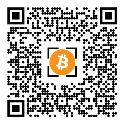
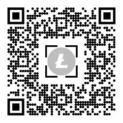

# CryptoFiat Garmin watch widget

my first app for learning prupose. The goal was to create a simple widget for my Garmin watch.

## Description

this app is allowing to explore the exchange rate of some crypto currencies.
First, the user is selecting the crypto currency or coin and then he is able to see the rate for different fiat currencies.

## Solution

the rates are loaded from the [Blockchain.com](https://www.blockchain.com/) using http request. The [Blockchain.com](https://www.blockchain.com/) API is easy to use, it does not require any auth and it is free to ask about the exchange rate.

the solution contains theese features:

- [BehaviorDelegate](https://developer.garmin.com/connect-iq/api-docs/Toybox/WatchUi/BehaviorDelegate.html) for handling the watch controls
- [Glance View](https://developer.garmin.com/connect-iq/api-docs/Toybox/WatchUi/GlanceView.html) for simple view fo glance nav
- background service to load the rate for the GlanceView
- progress "bar" as BehaviorDelegate
- switching between the views
- reusable drawing (like a parametrised components)
- rendering bitmaps, changing content

This project requere to setup Type Check Level: off.

If this source code was useful for you or the you like the app, you can support me:
[♥ Sponsor](https://github.com/sponsors/mayaleh) or

bc1qrg3pj4ng7hjz4e5n4f0k5ddcdqh5w7yhwskjup

or

LSrL2wg9W7F1rfD9FX2Aas1MUYbm96S4re

